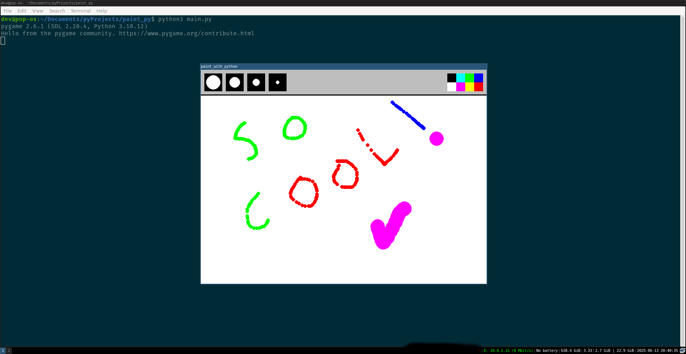

# Simple Paint Program

A basic paint program written in Python using Pygame, following a tutorial.

## Screenshot

## Features

- Basic drawing functionality
- Color selection
- Brush size adjustment

## Requirements

- Python 3.x
- Pygame

## Usage

1. Clone the repository: `git clone https://github.com/thedevdepot/paint_py.git`
2. Install Pygame: `pip install pygame`
3. Run the program: `python main.py`
