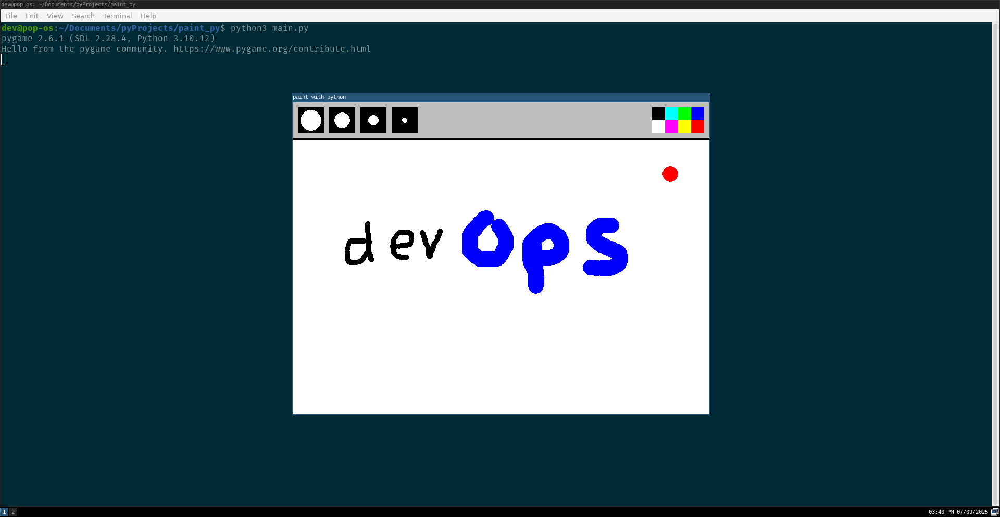

# Simple Paint Program

A basic paint program written in Python using Pygame, following a tutorial.

## Screenshot

## Features

- Basic drawing functionality
- Color selection
- Brush size adjustment

## Requirements

- Python 3.x
- Pygame

